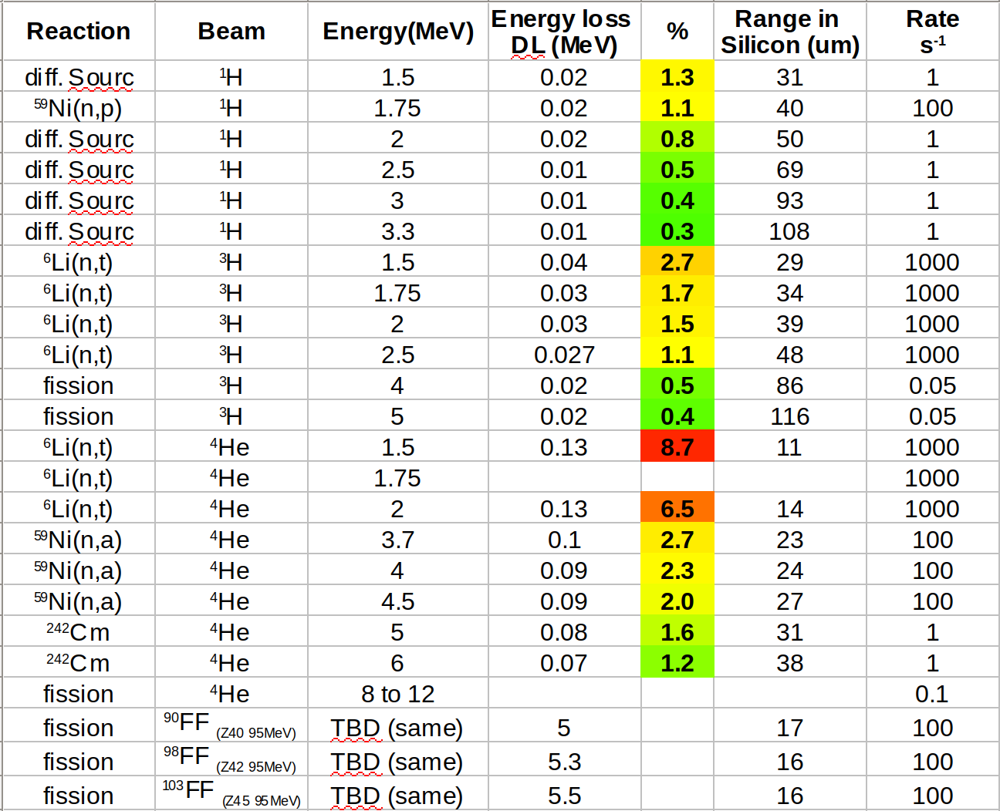

# Particle Classification

A particle classification machine learning model for fast classification of particles in the context of the N_Tof experiment

Data is taken with the following [experimental setup](https://www.ill.eu/for-all-users/instruments/instruments-list/pn1/description/instrument-layout)

With the following beam configurations: 

For full information see the [runbook](https://codimd.web.cern.ch/s/JCcIc-uTq#Runbook)

